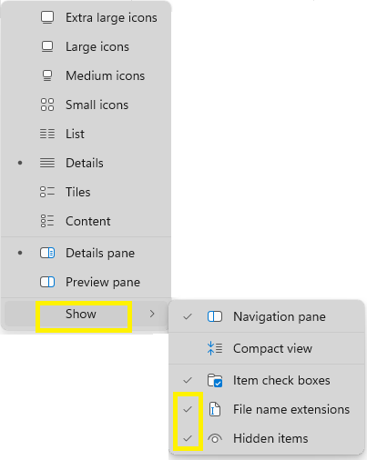
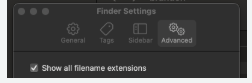

# 🟢 View File Extensions and Hidden Files/Folders

## File Extensions

**File extensions** are suffixes added to the end of a file name,
usually consisting of a period (dot) followed by a few characters.

File extensions indicate the file's format or type.

Common file extensions include:

- `.py` (Python files)
- `.ipynb` (Jupyter Notebook files)
- `.csv` (Comma-separated value files)
- `.md` (Markdown files)

Understanding file extensions is essential for identifying file types
and working with project files.

## Hidden Files and Folders

Some files and folders are hidden by default to prevent accidental
modification or deletion.

These hidden items often contain system configuration or project
settings.

In data analytics projects, we need to see these.

## Task 1. Enable View Settings

### On Windows:

1. Open **File Explorer**.
2. Click the **View** tab.
3. In the **Show** group, check:
   - **File name extensions**
   - **Hidden items**

### On Mac:

1. Open **Finder**.
2. Toggle hidden files and folders:
   - Press `Cmd` + `Shift` + `.` (dot)
3. Enable file extensions:
   - In Finder, go to **Finder > Settings > Advanced**
   - Check **Show all filename extensions**

### On Linux:

1. Open your file manager.
2. Enable viewing hidden files and folders:
   - Use the file manager's settings or menu option to show hidden files.
3. Enable viewing file extensions:
   - Use the file manager's settings to display file extensions.

## Verify

Open a folder and check that file names end with extensions
(for example `.txt` or `.py`) and that hidden files are visible.
