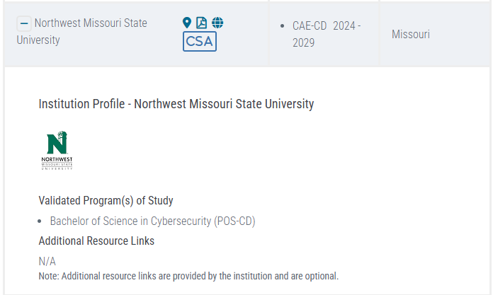

# Notes on CAE Talk

> Northwest Missouri State University is a **Center of Academic Excellence in Cybersecurity (CAE-C)**

## 2026-09-22

I'm sitting in on a Cybersecurity workshop and they are
telling students to "differentiate yourself with AI".
Learn how to use these powerful tools - and use them to make yourself valuable.

The speaker says AI can help us build faster, better, and safer than those who don't use it.
Preventing AI use he says is "professional malpractice".
We need people who can use these tools to do new things, now.
A few more notes from the speaker:

- As students, your job is to **explore and use all the AIs**.
- Figure out which is best for a task, and be able to make use of it.
- Use AI to be better than people not using AI.
- Use AI two hours every day.
- Commit yourself to being good at it.

## Speaker Suggested Goal For Students

How can I learn to use AI,
to be better than any single human without AI
and to be better than any AI without me.

## Note on Applied Courses

Many entry-level jobs can be handled by AI tools.
In applied courses, the minimum can be hard because we go beyond
some of what used to be learned in entry-level positions.

- git add/commit/push is not easy.
- installing new tools and configuring them to work on your machine is not easy.
- imagining, planning, implementing, understanding, and communicating custom projects is not easy.

The **minimum is already challenging**.

The way to set yourself apart is to
**push the boundaries of what you can do**
in our rapidly changing world.

