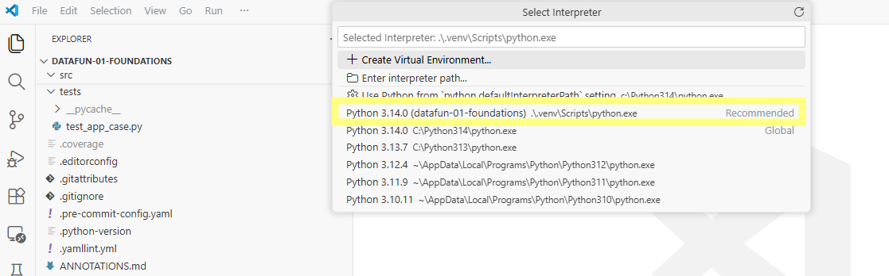

# 🔵 Set up Project Python Environment (managed by uv)

Each project uses its own Python environment
stored in a folder named **.venv** inside the project.

```text
project-repo-name/
  .venv/              # <--- project Python environment
  pyproject.toml
  README.md
```

This isolates dependencies, prevents conflicts with system Python,
and makes the project reproducible on any machine.
If something breaks, the **.venv** folder can be deleted and recreated.

## Before Starting

You should have already opened the project in **VS Code** using `code .`.

## Step 0. Open a New Terminal in VS Code

- Open a new terminal in VS Code,
  e.g., from the VS Code menu, select **Terminal / New Terminal**.

List the contents of the current folder:

```shell
ls
```

You are in the correct folder when you see files such as:

```text
pyproject.toml
README.md
```

<details markdown>
<summary>If you do NOT see those files (click here)</summary>

Follow the earlier steps carefully.
Continue once you see both `pyproject.toml` and `README.md`.

</details>

## Step 1. Create the Project Environment

Run the following commands in the VS Code terminal to:

1. Update **uv**.
2. Install the pinned Python version for this repository (installing that version if needed).
3. Upgrade the packages in the uv lock file for better security.
4. Create the **.venv** environment and install dependencies
   from **uv.lock** using **uv sync**.

**Updated 2026-Aug:** IMPORTANT NOTE ABOUT **uv sync** and **pyproject.toml**.

This new version assumes **pyproject.toml** uses the new  **[dependency-groups]**, with
**[tool.uv] default-groups = "all"**, so we can use the simple **uv sync**.

If your pyproject.toml uses the old  **[project.optional-dependencies]**,
use **uv sync --extra dev --extra docs** in place of **uv sync**.

```shell
uv self update

uv python install
uv lock --upgrade
uv sync
```

If prompted: "We noticed a new environment has been created.
Do you want to select it for the workspace folder?", click **Yes**.

<details markdown>
<summary>WHY?</summary>

Keeping tools updated is critical for security.
Each powerful tool may pull in many dependency packages.
When a vulnerability is found in a dependency,
a patched version is usually released quickly,
so we teach continuous update habits at school,
where working on the edge is allowed.
In production, updates may need to be more controlled.

</details>

### Step 1 Verify

- A **.venv/** folder appears in the project root
- The command finishes without errors

<details markdown="1">
<summary>If this step fails (click here)</summary>

#### If uv command not found

- Close and reopen VS Code.
- Verify **uv** was installed during **Workflow A. Set Up Machine**.

#### If Dependency install error

- Delete the **.venv/** folder.
- Rerun: **uv lock --upgrade** and **uv sync**

#### If Windows "Smart" Application Control error

If Windows reports: **An Application Control policy has blocked this file.**
or reports that **python.exe** was blocked, see:
[Windows: Smart App Control Blocks python.exe](../../help/04-windows-smart-app-control-python.md)
This is a Windows security-policy issue that happens on some machines.

</details>

## Step 2. Align VS Code with the Project Environment

### Step 2.1 Ensure VS Code uses the project .venv/

1. Open the **Command Palette** (menu: **View** / **Command Palette**, or **Ctrl+Shift+P**)
2. Type and choose: **Python: Select Interpreter**
3. Choose the interpreter inside **this project's **.venv** folder**




### Step 2.2. Restart the Python language server

1. Open the **Command Palette** (same as before).
2. Type or choose: **Developer: Reload Window**

### Step 2 Verify

- VS Code reloads
- No warnings about missing Python environments appear

---

[◄ Back to 🔵 Phase 1](index.md)
