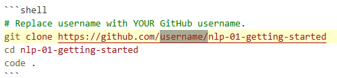
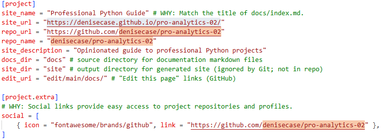
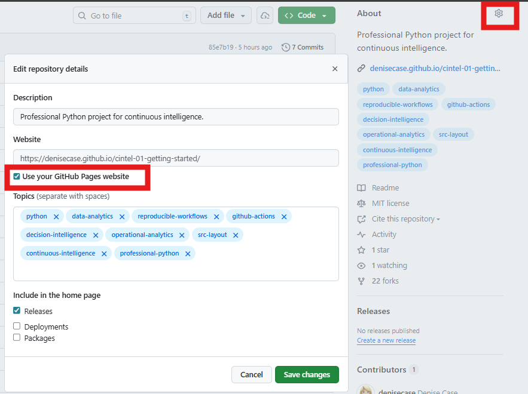
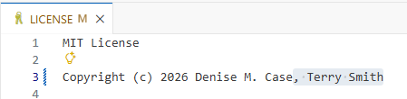
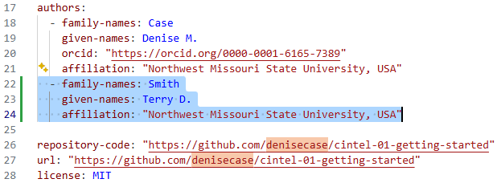

# 🔵 Update Authorship

After copying a template repo into your account, update the authorship.
Details are provided below so:

- README.md links reflect YOUR GitHub account.
- Your `zensical.toml` file makes a docs website for YOUR repository.
- Your Repo **About** section reflects YOUR GitHub Pages site.

## README.md

- Update the `git clone` command to reflect YOUR GitHub account.
- If needed, update any badges or repository links that reference the template repository.
- If needed, replace the template author's name if shown as the project author.

## zensical.toml (Project Documentation Site Configuration)

- Update the `site_name` and `site_description` as needed
- Update repository links, such as `site_url`, `repo_url`, `repo_name`, and `social` links.
- There are usually at least four locations to change as shown below.

## GitHub Repository "About" Section

When viewing your repository on GitHub, the **About** section appears in the upper right.

- Update so it links to YOUR GitHub Pages site (check the box).
- You will have to have Settings / Pages set to "GitHub Actions" (as described earlier).
- If you like, update the repository description.
- If you like, add/modify keywords.

## LICENSE

If the project includes a `LICENSE` file:

- add your name as the current author or maintainer
- keep the original attribution
- follow the terms of the license for your derived works

## CITATION.cff

If the project includes a `CITATION.cff` file:

- add your name as an additional author
- update `repository-code`
- update `url`

