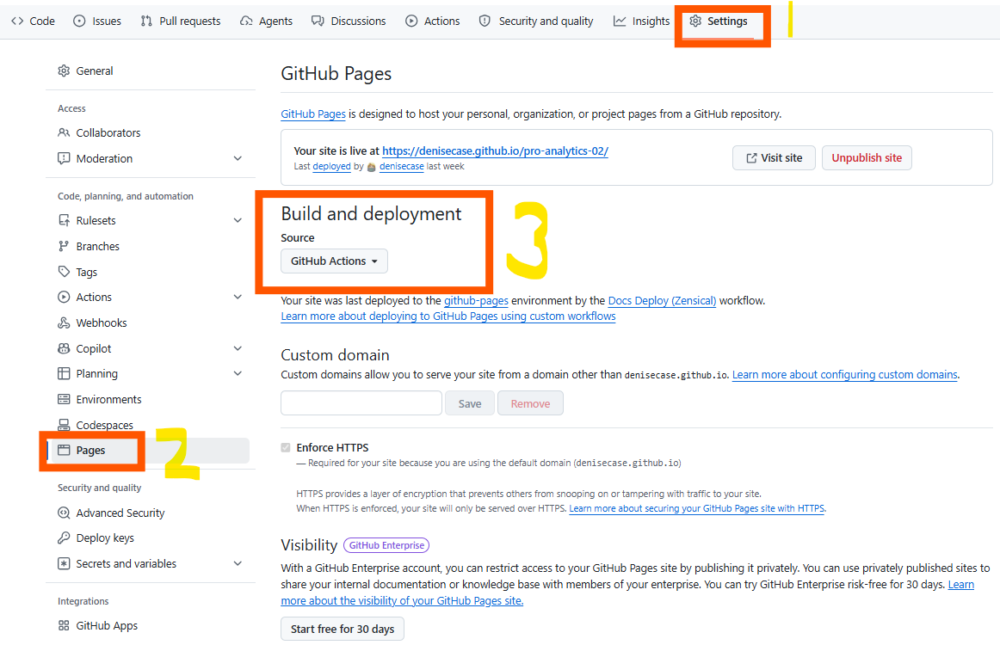

# 🔵 Configure GitHub Repository Settings

> Configure GitHub repository settings for your project.

## Enable GitHub Pages (for Project Documentation)

Enabling **GitHub Pages** allows a project to publish its documentation site.
This creates a professional, shareable documentation site
for your project instructions, setup steps, and technical notes.
Instructions (see image below):

1. In your new GitHub repository, click the **Settings** tab (gear icon, far right).
2. In the left sidebar, select **Pages**.
3. Under **Build and deployment / Source**, choose **GitHub Actions**
4. Click the **Code** tab (upper left) to return to the repository view.

Once enabled, GitHub will automatically build and publish
the documentation website when the documentation workflow runs.
An associated workflow should be provided in `.github/workflows/`.
You are not expected to write GitHub Actions on your own.

Note: Your project information will be different from the image,
but the settings work the same.

## Project Documentation

Our work requires **professional communication**, not just code.
A documentation site allows you to:

- explain the purpose of the project
- describe methods and techniques
- record experiments and results
- provide clear instructions for others

GitHub Pages provides a clean and professional way to publish project documentation.
The documentation site is separate from the source code and project outputs,
which reflects common professional practice.

## Note

Not every analytics project publishes documentation publicly,
but creating clear, professional project documentation is an important and valuable skill.

---

[◄ Back to 🔵 Phase 3](index.md)
