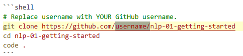
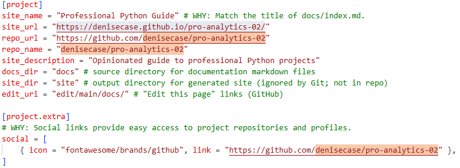
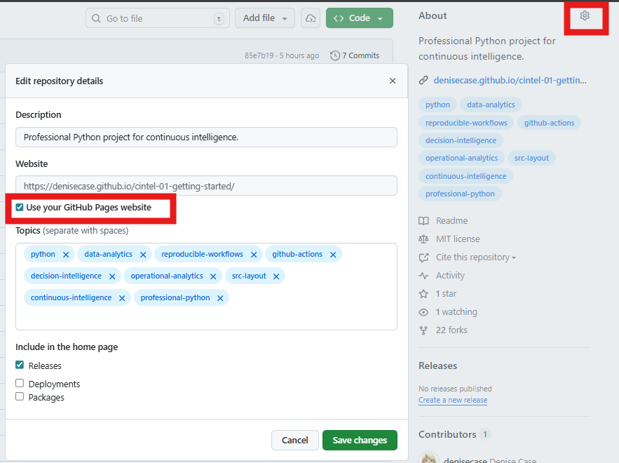

# 🔵 Update Authorship and Project Identity

After creating your independent project repository,
update the project authorship and repository references.

## Update File 1: README.md

- [ ] Update the `git clone` command to reflect YOUR GitHub account.
- [ ] Showcase your work with your own introduction using your name or alias.
- [ ] As needed, update any badges or repository links that reference the repository.

## Update File 2: pyproject.toml (Project Metadata)

- [ ] Update the project `name` and `description` to describe YOUR project.
- [ ] Update the `authors` entry to YOUR name.
- [ ] As needed, update any repository and documentation URLs (such as `Homepage`,
      `Repository`, and any `project.urls` links).

## Update File 3: zensical.toml (Project Documentation Site Configuration)

- [ ] Update the `site_name` and `site_description` as needed
- [ ] Update repository links, such as
      `site_url`, `repo_url`, `repo_name`, `social` links.

There are usually at least four locations to change.

## Update File 4: LICENSE

If the project includes a `LICENSE` file:

- [ ] Follow the terms of the license for your derived works
- [ ] Either delete the file or continue to license the work.
- [ ] If terms allow, set your name as the author or copyright holder

## Update File 5: CITATION.cff

If the project includes a `CITATION.cff` file:

- [ ] Either delete the file, keep the original and add your name, or replace it.
- [ ] Update `repository-code`
- [ ] Update `url`
- [ ] Set your name as author.

Generally, in academic projects, the intent is for you to use it and make it yours.
You can preserve credit (and blame) as you like,
but the intent is typically for you to use it as a foundation for your own projects.

## Finally, Update GitHub Repository "About" Section

When viewing your repository on GitHub,
the **About** section appears in the upper right.
Click the **About Settings** (gear icon).

- [ ] As needed, update the repository description.
- [ ] Check the box to use YOUR GitHub Pages site.
- [ ] As needed, add/modify keywords.

NOTE: Repository Settings / Pages must be set to "GitHub Actions"
(as described earlier).

[◄ Back to 🔵 Phase 3](index.md)
