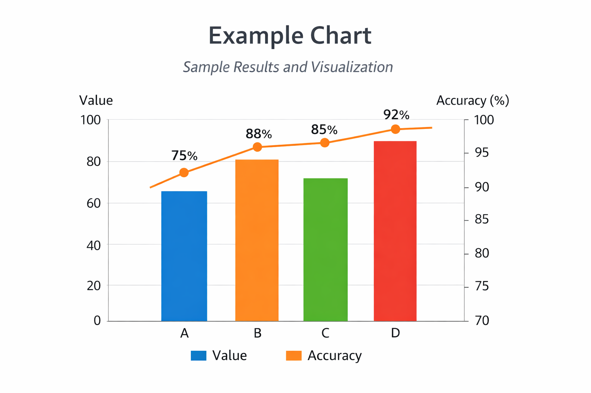

# 🔵  Apply Skills to Complete the Project

## Before Starting

Open your project repository in **VS Code**

## Task 1. Apply The Example To a Different Problem

Key techniques from the example are typically found in:

- `src/` - Python modules that implement the project logic
- `notebooks/` - Jupyter notebooks used for exploration and analysis

Apply the techniques shown in the example to a **different problem**.

When finished, finalize the associated project metadata and documentation.

## Task 2. Update Documentation To Present Your Project

Update `docs/` and `zensical.toml` to tell your story:

- update navigation entries if pages were added or removed
- edit pages in the `docs/` folder to narrate and present your project

## Task 3. Finalize `pyproject.toml`

Finalize `pyproject.toml` as needed:

- `dependencies` - include only packages your project needs
- ensure project **URLs** - replace starter GitHub links with your repository

## Task 4. Finalize `README.md`

Update the README so a new user can understand and run your project.
It should explain:

- what the project does
- how to set it up
- how to run it
- where to find documentation or notebooks

It should also **showcase your work**. Consider including:

- a key chart or visualization
- a small table of important results
- a short summary of insights or findings

Images and charts can be saved in the repository, for example, in the docs/images folder, and then displayed in the README like so:

## Other Project Files

Your repository includes additional configuration files for quality checks and automation.

You are generally encouraged to keep them as they are and explore them as time permits.
