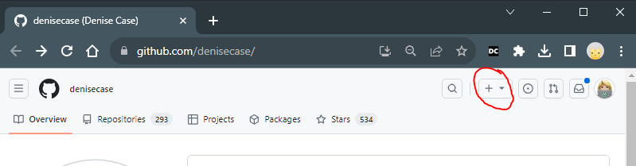

# 🟠 Start in GitHub to Create a New Repository

1. Log in to GitHub. Open your browser and log in to your GitHub account.

2. Go to the "Create Repository" Page

   - In the top-right corner of GitHub, click the + dropdown menu.
   - Select New repository.

3. Name Your Repository

   - Enter a name for your new repository.
   - IMPORTANT: Follow naming guidelines for Python Projects:
     - Use all lowercase.
     - Use dashes between words.
     - NEVER USE spaces or special characters.
     - Good Examples: my-python-project, python-experiments, baseball-stats, python-personal-project, website-analytics, student-impact-analysis

4. Provide a brief description of your project. This is optional but recommended.

5. Select the `Public` option so others can view your repository. You may always use a fake name or alias.

6. **IMPORTANT: Add a Default README File**

   - Check the box for Add a README file. This file is essential for the remaining steps in this guide.
   - If you omit the default README.md, these steps **will not work**.

7. Click the `Create repository` button to finalize the process and create your repo in GitHub.

## IMPORTANT

- If you forget to add a README file, delete the repository and start over. This time, check the box to add a default README.
- The subsequent steps will NOT work the same if the new repository does not have a file in the repo already.

