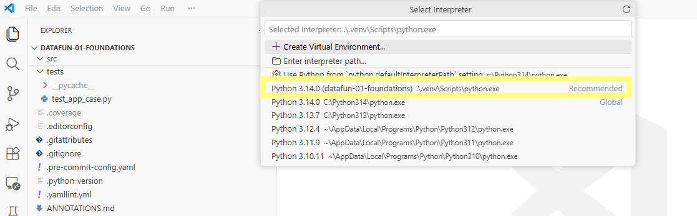

# 🟠 Set up Project Python Environment (managed by uv)

Each project uses its own environment stored inside the project in a folder named `.venv`.
This keeps dependencies isolated, prevents conflicts with system Python, and ensures the project can be reproduced on any machine.

If something breaks, the `.venv` folder can be deleted and recreated as needed.

## Before Starting

You should have opened a machine terminal and used `code .` to open your project folder in **VS Code**.

Open a default **terminal inside VS Code** (Windows: PowerShell, macOS: zsh, Linux / WSL: bash) and list the contents of the correct folder:

```shell
ls
```

### Verify

The terminal is correctly open in the root project folder
if the list includes files such as `pyproject.toml` and `README.md`.

<details>
<summary>If you do NOT see those files (click here)</summary>

Use this process to open the project and correctly configure VS Code:

1. Close VS Code completely.
2. Open a **machine terminal** (not the VS Code terminal).
3. Navigate to your `Repos` folder. See Workflow 01: Set Up Machine.
4. In the command below, change replace `pro-analytics-02` with your actual project repository name.
5. Use `cd` to change directory into your project repository folder.
6. Use `code .` to open the project in VS Code.

```shell
cd pro-analytics-02
code .
```

(Replace `pro-analytics-02` with your actual project folder name.)

Verify again in VS Code terminal:

```shell
ls
```

Continue once you see `pyproject.toml` and `README.md`.

</details>

## 1A. Set Up the Environment

Run these commands in your VS Code terminal:

```bash
uv self update
uv python pin 3.14
uv sync --extra dev --extra docs --upgrade
```

This will:

1. Update `uv`
2. Pin the Python version for this repo (and install that version if needed)
3. Install project dependencies listed in `pyproject.toml`.
4. If notification: "We noticed a new environment has been created. Do you want to select it for the workspace folder?" Click "Yes".

### Verify

- Verify that a new `.venv/` folder appears in the project root. You must be able to see hidden files and folders - see Workflow 01: Set Up Machine for details.
- The command finishes without error messages.

<details>
<summary>If this step fails (click here)</summary>

- **`uv` command not found**
  - Close and reopen VS Code
  - Verify `uv` was installed during machine setup
- **Python version error**
  - Rerun: `uv python pin 3.14`
- **Dependency install error**
  - Delete the `.venv/` folder
  - Rerun: `uv sync --extra dev --extra docs --upgrade`

</details>

## 1B. Set Up Pre-Commit Hooks

Optional (recommended): install and run pre-commit checks:

```shell
uvx pre-commit install
git add -A
uvx pre-commit run --all-files
```

### Verify

- Commands complete without fatal errors

<details>
<summary>If pre-commit fails</summary>

Pre-commit can fail even when `uv sync` works because it depends on Git hooks and your machine configuration.

Common reasons and quick fixes:

1. You are not in the project root folder

- Symptom: errors about missing config, or it cannot find files.
- Fix:
  - Run `ls` and confirm you see `.git/`, `.pre-commit-config.yaml` (if used), and `pyproject.toml`.
  - If not, stop and reopen the project using `code .` from a machine terminal.

2. Git is not available (or not working)

- Symptom: messages mentioning `git`, or "not a git repository".
- Fix:
  - Run: `git status`
  - If that fails, fix Git installation/sign-in first (machine setup step), then try pre-commit again.

3. `uvx` is not available

- Symptom: `uvx: command not found` (or similar).
- Fix:
  - Close VS Code completely and reopen it.
  - Run `uv --version` to confirm uv is available.
  - If `uv` works but `uvx` does not, update uv: `uv self update`, then retry.

4. Hooks could not be installed

- Symptom: `pre-commit install` fails or mentions `.git/hooks`.
- Fix:
  - Ensure the repo was cloned (not downloaded as a ZIP).
  - On restricted machines, Git hooks may be blocked. In that case, skip pre-commit and continue.

5. Pre-commit ran and reported failures (this is normal)

- Symptom: output shows files were reformatted, or checks failed.
- Fix:
  - Run again to confirm it is clean:
    - `uvx pre-commit run --all-files`
  - Then stage changes:
    - `git add -A`

If you still cannot get it to run after trying the fixes above,
it is generally fine to skip pre-commit and continue without it.

</details>

## 2: Align VS Code with The Environment (.venv)

<mark> **IMPORTANT**: DO NOT SKIP THIS (or any) STEP</mark>

In VS Code, select the project Python interpreter:

1. Open the **Command Palette** (from the menu, select **View** / **Command Palette**, or hit **Ctrl+Shift+p**).
2. Type and choose: `Python: Select Interpreter`
3. Important: Choose the interpreter inside **this project's `.venv` folder**




Restart the Python language server:

1. Open the **Command Palette** (same as before).
2. Type or choose: `Developer: Reload Window`

### Verify

- VS Code reloads
- No warnings about missing Python environments appear

## Option: Pin Earlier Python Version (as Needed)

If a tool like **Apache Kafka** or **Apache Spark** requires an older Python version, specify the required version when you pin:

```bash
uv python pin 3.14
uv sync --extra dev --extra docs --upgrade
```

### Verify

- `.python-version` updates
- `.venv/` is recreated
- The project runs successfully again
