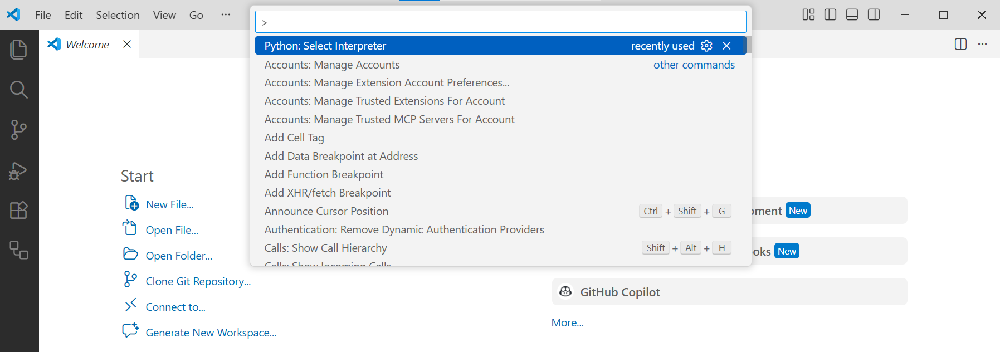
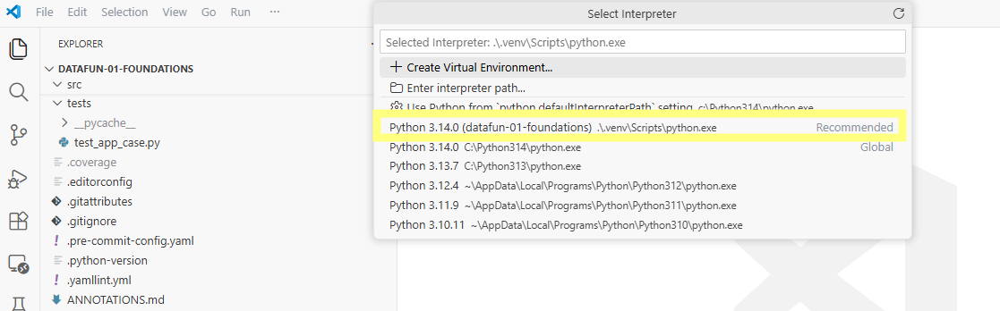

# 🟠 Set up Project Python Environment (managed by uv)

Each project uses its own Python environment stored in a folder named `.venv` inside the project.

```text
project-repo-name/
├─ .venv/           # project Python environment
├─ pyproject.toml
└─ README.md
```

This isolates dependencies, prevents conflicts with system Python, and makes the project reproducible on any machine.
If something breaks, the `.venv` folder can be deleted and recreated.

## Before Starting

You should have already opened the project in **VS Code** using `code .`.

Open a **VS Code terminal** and list the contents of the current folder:

```shell
ls
```

You are in the correct folder when you see files such as:

```shell
pyproject.toml
README.md
```

<details>
<summary>If you do NOT see those files (click here)</summary>
Follow the earlier steps carefully.
Continue once you see both `pyproject.toml` and `README.md`.
</details>

## Step 1. Create the Project Environment

Run the following commands in the VS Code terminal to:

1. Update `uv`.
2. Pin the Python version for this repository (installing that version if needed).
3. Create the `.venv` environment and install dependencies from `pyproject.toml` using `uv sync`.

```bash
uv self update
uv python pin 3.14
uv sync --extra dev --extra docs --upgrade
```

If prompted: "We noticed a new environment has been created. Do you want to select it for the workspace folder?", click **Yes**.

### Step 1 Verify

- A `.venv/` folder appears in the project root
- The command finishes without errors

<details>
<summary>If this step fails (click here)</summary>

**`uv` command not found**

- Close and reopen VS Code
- Verify `uv` was installed during Workflow A. Set Up Machine.

**Python version error**

- Rerun: `uv python pin 3.14`

**Dependency install error**

- Delete the `.venv/` folder
- Rerun: `uv sync --extra dev --extra docs --upgrade`

</details>

## Step 2. Set Up Pre-Commit Hooks

Pre-commit hooks catch common issues before code is committed and pushed to GitHub.

Run the following commands in the VS Code terminal to:

1. Install the pre-commit Git hooks for this repository
2. Stage all files (so pre-commit can check them)
3. Run the checks once explicitly

```shell
uvx pre-commit install
git add -A
uvx pre-commit run --all-files
```

After the hooks are installed, pre-commit checks run automatically on every `git commit` command.

### Step 2 Verify

- Commands complete without fatal errors

<details>
<summary>If pre-commit fails</summary>
Pre-commit may fail on restricted machines where Git hooks cannot be installed.
If this occurs, it is safe to skip pre-commit and continue with the project.
</details>

## Step 3. Align VS Code with the Project Environment

### Step 3.1 Ensure VS Code uses the project `.venv`

1. Open the **Command Palette** (menu: **View** / **Command Palette**, or `Ctrl+Shift+P`)
2. Type and choose: `Python: Select Interpreter`
3. Choose the interpreter inside **this project's `.venv` folder**





### Step 3.2. Restart the Python language server:

1. Open the **Command Palette** (same as before).
2. Type or choose: `Developer: Reload Window`

### Step 3 Verify

- VS Code reloads
- No warnings about missing Python environments appear

## OPTION for Step 3.1: Pin a Different Python Version

Some tools (such as Spark or Kafka) may require an earlier Python version.
If so, pin the required version.
For example:

```bash
uv python pin 3.12
uv sync --extra dev --extra docs --upgrade
```
