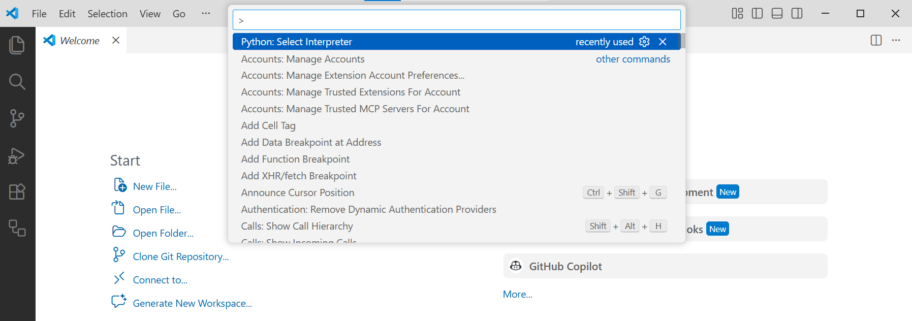

# 🟠 Set up Project Python Environment (managed by uv)

Each project uses its own Python environment stored in a project folder named **.venv**.

```text
project-repo-name/
  .venv/             # <--- project Python environment
  pyproject.toml
  README.md
```

This isolates dependencies, prevents conflicts with
system Python, and makes the project reproducible on any machine.
If something breaks, the **.venv/** folder can be deleted and recreated.

## Before Starting

You should have already opened the project in **VS Code** using `code .`.

Open a **VS Code terminal** and list the contents of the current folder:

```shell
ls
```

You are in the correct folder when you see files such as:

```text
pyproject.toml
README.md
```

<details markdown>
<summary>If you do NOT see those files (click here)</summary>

Follow the earlier steps carefully.
Continue once you see both **pyproject.toml** and **README.md**.

</details>

## Step 1. Create the Project Environment

Run the following commands in the VS Code terminal.
Copy and paste one command at a time and hit Enter or Return after pasting to run it.

```bash
uv self update
uv python pin 3.14
uv python install
uv lock --upgrade
uv sync
uv audit
```

These commands:

1. Keep `uv` updated. This may not work if uv was installed with a package manager
   such as Homebrew; in that case, update uv with that package manager.
2. Pin the desired Python version (creates `.python-version`).
3. Install the Python version pinned by the project (see `.python-version`).
4. Update the project dependency versions allowed by pyproject.toml and
   record the resolved versions in `uv.lock`.
5. Create or update the project `.venv` and install the project dependencies recorded in `uv.lock`.
6. Audit all dependencies for known vulnerabilities and adverse package statuses.

If prompted: "We noticed a new environment has been created.
Do you want to select it for the workspace folder?", click **Yes**.

NOTE: If uv sync completes successfully but reports that it could not hardlink files
and is falling back to copying them, you may continue.
This is a performance warning, not an installation failure.

## Important: Environment Verification

Run:

```shell
uv run python --version
uv run python -c "import sys; print(sys.executable)"
```

Verify:

- **.venv/** appears in the project root.
- The commands complete without errors.
- The reported Python executable is inside this project's **.venv** folder.

<details markdown="1">
<summary>If this step fails (click here)</summary>

**uv** command not found:

- Close and reopen VS Code
- Verify **uv** was installed during **Workflow A. Set Up Machine**.

Dependency install error:

- Delete the **.venv/** folder
- Rerun: **uv lock --upgrade**
- Rerun: **uv sync**

</details>

## 2. Set Up Pre-Commit Hooks

Pre-commit hooks catch common issues before code is committed and pushed to GitHub.

Run the following commands in the VS Code terminal to:

1. Install the pre-commit Git hooks for this repository
2. Stage all files (so pre-commit can check them)
3. Run the checks once explicitly

```shell
uv run pre-commit install
git add -A
uv run pre-commit run --all-files
```

After the hooks are installed,
pre-commit checks run automatically on every **git commit** command.

<details markdown>
<summary>If pre-commit fails</summary>

Pre-commit may fail on restricted machines where Git hooks cannot be installed.
If this occurs, it is safe to skip pre-commit and continue with the project.

</details>

## 3. Align VS Code with the Project Environment

### Ensure VS Code uses the project .venv/

1. Open the **Command Palette** (menu: **View** / **Command Palette**, or **Ctrl+Shift+P**)
2. Type and choose: **Python: Select Interpreter**
3. Choose the interpreter inside **this project's **.venv** folder**




### Reload VS Code

1. Open the **Command Palette** (same as before).
2. Type or choose: **Developer: Reload Window**

## Verification

- VS Code uses the Python interpreter inside this project's **.venv/** folder.
- VS Code reloads without warnings about a missing Python environment.

---

[◄ Back to 🟠 Workflow C](index.md)
