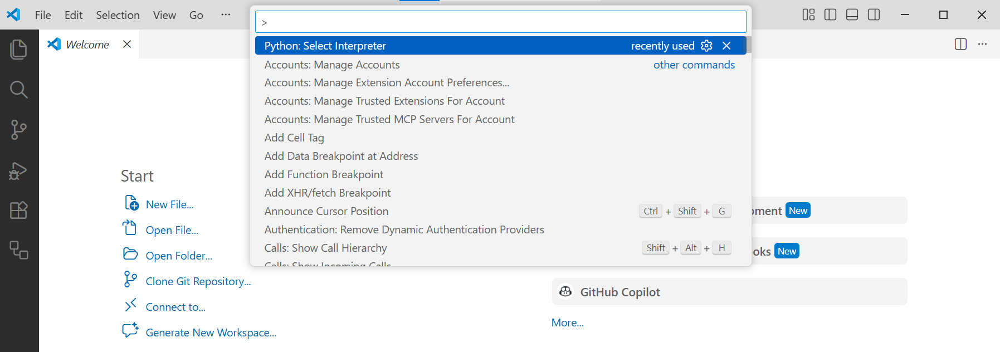
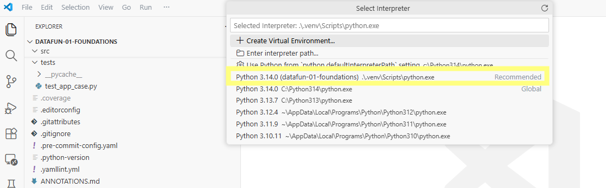

# 🟠 Set up Project Python Environment (managed by uv)

Each project uses its own Python environment stored in a project folder named **.venv**.

```text
project-repo-name/
  .venv/             # <--- project Python environment
  pyproject.toml
  README.md
```

This isolates dependencies, prevents conflicts with
system Python, and makes the project reproducible on any machine.
If something breaks, the **.venv/** folder can be deleted and recreated.

## Before Starting

You should have already opened the project in **VS Code** using `code .`.

Open a **VS Code terminal** and list the contents of the current folder:

```shell
ls
```

You are in the correct folder when you see files such as:

```text
pyproject.toml
README.md
```

<details markdown>
<summary>If you do NOT see those files (click here)</summary>

Follow the earlier steps carefully.
Continue once you see both **pyproject.toml** and **README.md**.

</details>

## Step 1. Create the Project Environment

Run the following commands in the VS Code terminal.
Copy and paste one command at a time and hit Enter or Return after pasting to run it.

```bash
uv self update
uv python pin 3.15
uv python install
uv lock --upgrade
uv sync
uv audit
```

These commands:

1. Keep `uv` updated. This may not work if uv was installed with a package manager
   such as Homebrew; in that case, update uv with that package manager.
2. Pin the desired Python version (creates `.python-version`).
3. Install the Python version pinned by the project (see `.python-version`).
4. Update the project dependency versions allowed by pyproject.toml and
   record the resolved versions in `uv.lock`.
5. Create or update the project `.venv` and install the project dependencies recorded in `uv.lock`.
6. Audit all dependencies for known vulnerabilities and adverse package statuses.

If prompted: "We noticed a new environment has been created.
Do you want to select it for the workspace folder?", click **Yes**.

NOTE: If uv sync completes successfully but reports that it could not hardlink files
and is falling back to copying them, you may continue.
This is a performance warning, not an installation failure.

## Important: Environment Verification

Run:

```shell
uv run python --version
uv run python -c "import sys; print(sys.executable)"
```

Verify:

- **.venv/** appears in the project root.
- The commands complete without errors.
- The reported Python executable is inside this project's **.venv** folder.

<details markdown="1">
<summary>If this step fails (click here)</summary>

**uv** command not found:

- Close and reopen VS Code
- Verify **uv** was installed during **Workflow A. Set Up Machine**.

Dependency install error:

- Delete the **.venv/** folder
- Rerun: **uv lock --upgrade**
- Rerun: **uv sync**

</details>

## 2. Set Up Git Hooks

You should have already created the project environment
and opened the project in VS Code.

Git hooks catch common issues before code is committed and pushed to GitHub.

Run the following commands in the VS Code terminal to:

1. Set up prek to run Git hooks for this repository.
2. Stage all project files.
3. Run the configured checks.
4. If any files are automatically corrected, review the changes and run the checks again.

Copy and paste one command at a time and press Enter or Return.

```shell
uvx prek install --force
git add -A
uvx prek run --all-files
```

If checks automatically modify files,
**review the changes and re-run** (UP ARROW):

```shell
uvx prek run --all-files
```

After the hooks are installed, they run automatically during `git commit`.

For more information, see
[Git Hooks: Automated Quality Checks](../../tools/github-and-ci/00-git-hooks.md).

<details markdown>
<summary>If Git hooks cannot be installed</summary>

On some restricted machines, Git hooks may not be permitted.

You can continue working without installing the hooks.
Run the configured checks manually when possible:

```shell
uvx prek run --all-files
```

Required project checks must still pass before work is considered complete.

</details>

<details markdown>
<summary>If checks fail</summary>

Checks may fail on restricted machines where Git hooks cannot be installed.
If this occurs, it is safe to skip them and continue with the project.

</details>

## 3. Align VS Code with the Project Environment

### Ensure VS Code uses the project .venv/

1. Open the **Command Palette** (menu: **View** / **Command Palette**, or **Ctrl+Shift+P**)
2. Type and choose: **Python: Select Interpreter**
3. Choose the interpreter inside **this project's **.venv** folder**





### Reload VS Code

1. Open the **Command Palette** (same as before).
2. Type or choose: **Developer: Reload Window**

## Verification

- VS Code uses the Python interpreter inside this project's **.venv/** folder.
- VS Code reloads without warnings about a missing Python environment.

---

[◄ Back to 🟠 Workflow C](index.md)
